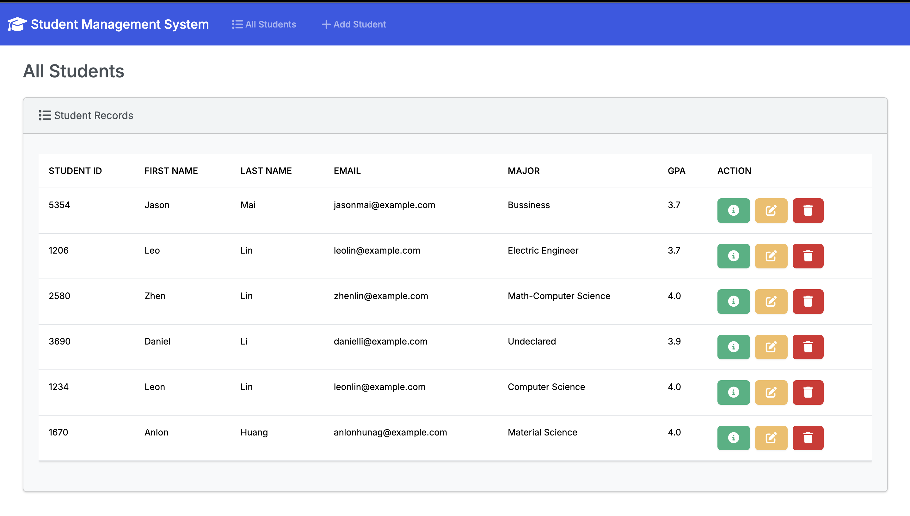
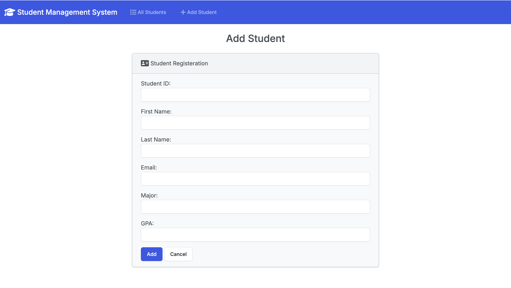
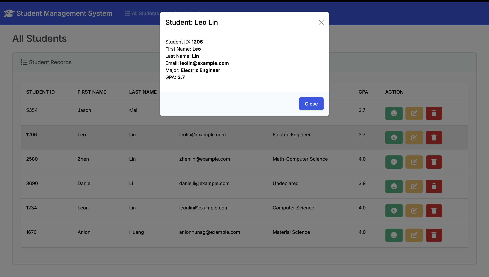
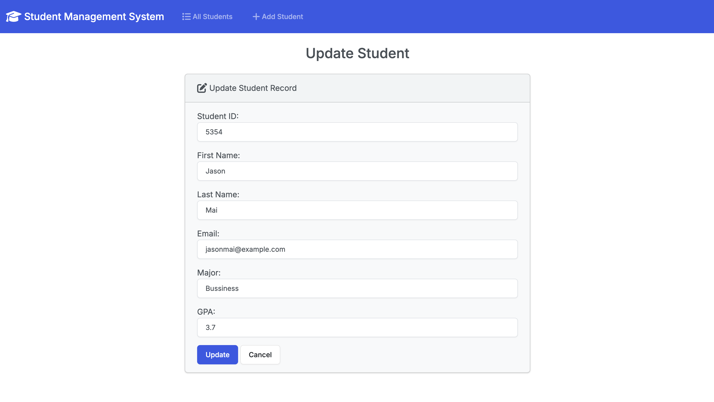
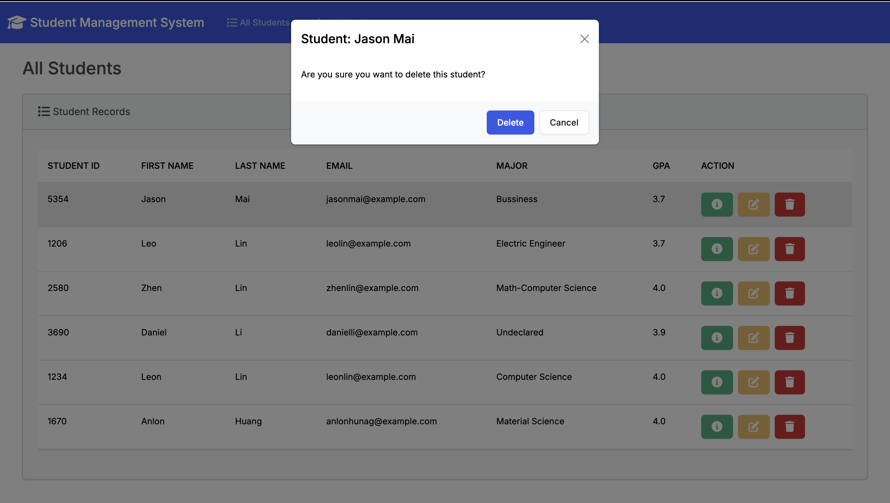

# Student Management System

## Description: 
This is a Student Management System built using `Django` and `Python` as the Backend, `HTML` and `BootStrap` as the Frontend and SQLite as the Database. 

The Student Management System has the functions of listing all Students, Adding new student to the Student Management System, updating Student's information and deleting a student from the Student Management System. 

## Home Page:

## Adding New Student:

## View Student Information:

## Updating Student Information:

## Deleting a Student:
